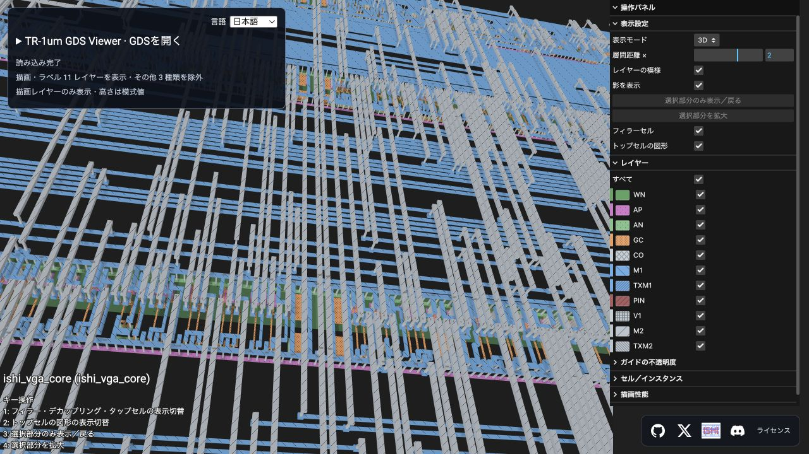

# TR-1um GDS Viewer

**OpenSUSI TR-1um の半導体レイアウトを、ブラウザで立体的に眺めるビューア。**
GDSファイル・URL・ISHI会のMPWプリセットから開いて、配線やセルを3D／2Dで確認できます。

## [▶ ビューアを開く](https://penguineino.github.io/tr1um_gds_viewer/)

[Tiny Tapeout GDS Viewer](https://github.com/TinyTapeout/tinytapeout_gds_viewer) をforkし、TR-1um向けに調整しています。
日本語・English・简体中文に対応。

[X / @Penguininin_](https://x.com/Penguininin_) · [ISHI会](https://ishi-kai.org/) · [ISHI会 Discord](https://discord.gg/Sj47dJk8x7)

[Apache-2.0](LICENSE) · [クレジット・依存ライブラリのライセンス](THIRD_PARTY_NOTICES.md)
